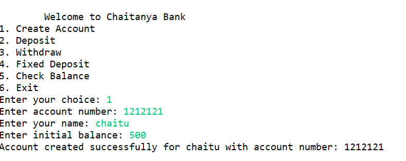
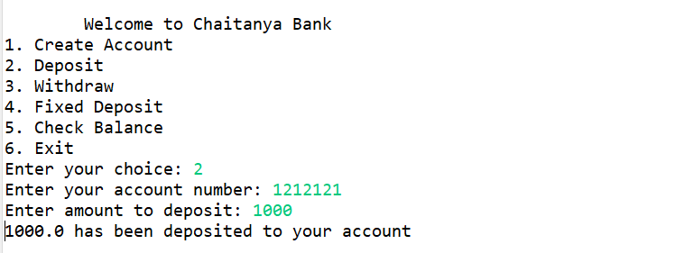
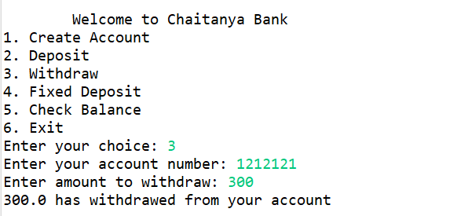
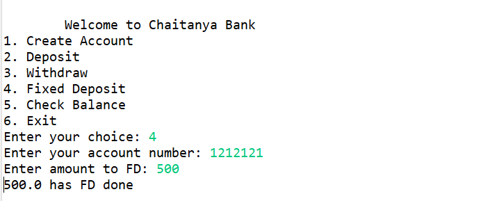

# Bank_management_System

# 🏦 Banking Management System (Java)

A simple **Banking Management System** built in Java that allows users to create accounts, deposit money, withdraw money, open Fixed Deposits (FD), and check balances.  
This is a **Core Java console-based project** using `HashMap` for storing accounts in memory.

---

## 📌 Features

- **Create Account** – Create a new bank account with account number, name, and initial balance.
- **Deposit Money** – Add money to an account.
- **Withdraw Money** – Withdraw money from an account.
- **Fixed Deposit (FD)** – Transfer funds into a fixed deposit.
- **Check Balance** – View both available balance and FD amount.
- **Exit** – Close the application.

---

## 🛠 Technologies Used
- **Java** (Core Java concepts)
- **Collections Framework** (`HashMap`)
- **OOP Principles** (Encapsulation, Abstraction)
- **Console I/O** (`Scanner`)

---

## 📸 Output Screenshots

### 2️⃣ Creating an Account (Input: Account No, Name, Initial Balance)

### 3️⃣ Deposit Money (Input: Account No, Deposit Amount)

### 4️⃣ Withdraw Money (Input: Account No, Withdraw Amount)

### 5️⃣ Fixed Deposit (Input: Account No, FD Amount)

### 6️⃣ Check Balance (Output: Available Balance, FD Amount)

